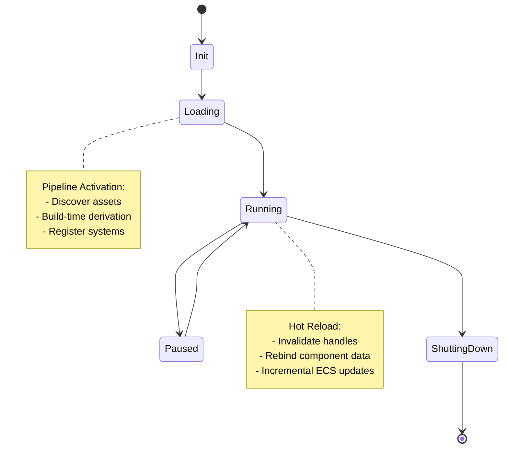
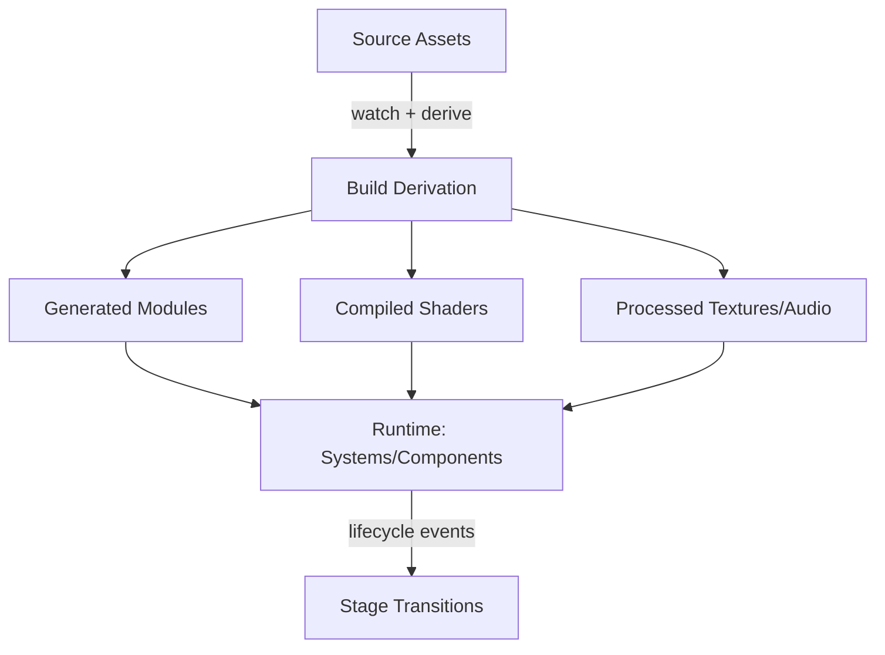

## Architecture

### Component Model

At the heart of YAGE is a **component-based architecture**. Every engine feature — rendering, physics, input, asset pipelines, and entity management — is packaged as a discrete **orthogonal component**.

In practice, YAGE projects are often organized by **feature folders** (e.g., `player/`, `enemy/`, `ui/`) where code and assets are co-located. This reinforces the component-based philosophy and makes ownership intuitive for teams.

Core principles of the component model:

* **Orthogonality:** components operate independently with well-defined inputs and outputs.

* **Granularity:** features are broken into minimal, composable units (e.g., mesh renderer vs. full graphics pipeline).

* **Replaceability:** components can be swapped with custom implementations without breaking the rest of the engine.

* **Composable APIs:** components expose declarative, trait-driven interfaces that can be combined at compile time.

In YAGE’s architecture, assets are not just resources — they are **structural inputs** that directly compose the runtime. Each component declares the asset types it consumes and exposes a schema describing how those assets translate into ECS entities, components, and systems.

This means that assembling a game world often involves defining **asset graphs** rather than writing imperative setup code. For instance, a `scene.glb` (glTF 2.0 scene) might automatically instantiate entities with physics colliders, renderable meshes, and materials; a `ui.svg` or `menu.lottie.json` may register interactive regions and transitions; and a `behavior_tree.json` can link to a Lua or WASM behavior module providing decision logic.

The engine’s job is not to reinterpret these formats but to **bind them predictably** to components through schema reflection and system registration. Each system declares what asset formats it supports, using existing open specifications wherever possible. Developers extend this behavior by registering new schemas or bindings — not by modifying engine code.

This design avoids monolithic subsystems and ensures developers assemble only what their game requires.

#### ECS Data Layout & APIs (MVP)

* **EntityId:** 64-bit `{index:u32, generation:u32}` (generational free list guarantees dangling-handle safety).

* **Storage backends (pluggable):**
  * `ArchetypeSoA` (chunked, cache-friendly; great for wide queries).
  * `SparseSetSoA` (fast add/remove; good for sparse components).
  * Select at world creation or per-component; both implement `StorageBackend`.

* **Minimal API surface:**

```rust
let e = world.spawn((
    Transform::default(),
    Velocity::zero(),
    Sprite { atlas: id("hero"), frame: 0 },
));

world.despawn(e);

if let Some(t) = world.get::<Transform>(e) { /* read-only */ }
if let Some(v) = world.get_mut::<Velocity>(e) { v.x += 1.0; }

for (t, mut v) in world.query::<(Read<Transform>, Write<Velocity>)>() {
    v.integrate(t, dt);
}
```

* **Bundles & Derive:** `#[derive(Component)]`; bundles are tuples; codegen produces registration & reflection (hash-stable type IDs).

* **Change Detection:** per-component tick counters (32-bit), world tick increments per fixed update; `is_modified_since(tick)` aids rendering culling, net sync.

* **Events:** typed ring-buffer channels (`Event<T>`), single-producer multi-consumer; consumed during `FrameBegin`.

* **Safety & Aliasing:** borrow rules enforced at query construction; write/write conflicts prevented by scheduler; `unsafe` confined to storage internals.

### Engine Core and Runtime

YAGE’s **engine core** is intentionally minimal. Its primary responsibilities are:

* Initializing and orchestrating components.

* Managing the execution lifecycle (update loops, scheduling, event handling).

* Providing minimal abstractions for time, logging, and error management.

The runtime is **not a heavy framework** — instead, it is a **thin kernel** that coordinates components. By minimizing core responsibilities, YAGE maximizes flexibility, allowing projects to scale from small 2D prototypes to complex 3D worlds without excess runtime weight.

#### Runtime Loop (MVP)

The core loop uses a fixed-timestep update with a decoupled render present, for example:

```rust
pub struct Engine {
    world: World,
    scheduler: Scheduler,
    renderer: Renderer,
    platform: Platform,
}

impl Engine {
    pub fn run(mut self) -> ExitCode {
        const FIXED_DT: f32 = 1.0 / 60.0; // [TBD: 60 or 120]
        let mut clock = FixedClock::new(FIXED_DT);
        loop {
            self.platform.poll_events(&mut self.world);
            if self.world.signals().should_quit() { break; }

            // Run zero-or-more fixed updates this frame
            clock.step(self.platform.now_seconds(), |dt| {
                self.scheduler.run_phase(Phase::FrameBegin, dt, &mut self.world);
                self.scheduler.run_phase(Phase::Update,     dt, &mut self.world);
                self.scheduler.run_phase(Phase::RenderPrep, dt, &mut self.world);
                self.scheduler.run_phase(Phase::FrameEnd,   dt, &mut self.world);
            });

            self.renderer.present(&mut self.world); // VSYNC optional; see perf policy
        }
        ExitCode::SUCCESS
    }
}
```

#### Systems Scheduler (Jobs)

The scheduler executes a dependency-aware job graph per **Phase** with stable ordering when constraints tie, for example:

* **Phases**: `FrameBegin`, `Update`, `RenderPrep`, `FrameEnd`.
* **System descriptor:**
  * `reads: [Comp<T>], writes: [Comp<U>]` (conflict-aware)
  * `phase: Phase`
  * `before/after: [SystemId]` (explicit edges)
  * `tags: [“audio”, “physics”, …]` (optional grouping)
* **Execution:** lock-free work-stealing queue; pin CPU affinity optional; stable seed ensures deterministic tie-breaks.
* **Determinism:** with the same registration order, RNG seed, and input events, the schedule is stable.

```rust
pub struct SystemDesc {
    pub name: &'static str,
    pub phase: Phase,
    pub reads: Vec<TypeId>,
    pub writes: Vec<TypeId>,
    pub before: Vec<&'static str>,
    pub after: Vec<&'static str>,
}

scheduler.register(SystemDesc {
    name: "physics.integrate",
    phase: Phase::Update,
    reads: vec![tid!(Transform)],
    writes: vec![tid!(Velocity)],
    before: vec![],
    after: vec![],
});
```

#### Time & Determinism Policy

* **Fixed step:** `dt = 1/60` or `1/120` (TBD). Accumulator runs multiple updates if the render frame is long; clamp at `[TBD: 3]` updates to avoid spiral.
* **RNG:** per-system deterministic RNG seeded by `{build_sha, scene_hash, frame_index}` (document seed surface).
* **Input:** event queue snapshot taken at `FrameBegin` and replayed identically during re-sims.
* **Clocks:** monotonic clock; cap delta between frames (e.g., `≤ 100 ms`) to protect physics after long stalls.

*These policies tie directly to **Performance & Optimization → Benchmarking Approach** and the CI determinism checks.*

#### Input & Events (MVP)

**Goals:** deterministic replay, low-latency feel, and clean separation between platform events and gameplay.

**Event Types**
* `InputEvent::Key { code, state, mods }`
* `InputEvent::Pointer { id, pos, delta, kind, state }`
* `InputEvent::Gamepad { id, axis/buttons, state }`
* `WindowEvent::Resize { size }`, `Focus`, `CloseRequested`
* `Custom<T: Serialize>` for editor or domain events

**Acquisition & Snapshot**
* Platform backend pushes events into a `RingQueue<InputEvent>` during OS polling.
* At **`FrameBegin`**, the queue is **snapshotted** into `InputState` (immutable for the fixed step).
* Systems read from `InputState` or subscribe to `Event<T>` channels; no direct OS calls inside systems.

**Mapping Layer**
* `InputMap` converts device events → actions/axes (e.g., `"move_x"`, `"jump"`), with device-agnostic bindings.
* `InputMap` is data-driven; hot-reloadable via the asset pipeline.

**Determinism & Replay**
* Recording: persist `InputState` deltas per fixed tick with a seed in the header.
* Replay: replace platform queue with the recorded stream; physics and gameplay become deterministic.

**API (sketch)**
```rust
if input.action_down("jump") { commands.emit(Event::<Jump>::default()); }
let aim: f32 = input.axis("aim_x");
for ev in input.events::<PointerClick>() { /* UI */ }
```

### Configuration System

The **Configuration System** implements the *Configurability* principle introduced in the Core Philosophy section. It provides a concrete mechanism for expressing and managing how engine components, assets, and runtime parameters are composed and connected.

YAGE uses a **configuration-driven assembly model**, inspired by how tools like Webpack bundle code. Developers declare which components to include and how they should interact, and YAGE builds a tailored engine accordingly.

Configuration can be expressed through:

* **Declarative project manifests** (Cargo integration + engine-specific metadata).
* **Programmatic configuration** (Rust code that composes traits and systems).
* **Automatic inference** (components activated by the presence of certain assets).

This approach allows for **smart defaults** while preserving full developer control. Like Webpack, YAGE prioritizes flexibility without sacrificing performance.

#### Effective Merge Order

1. Base (project defaults)  
2. Profile (e.g., `dev`, `release`)  
3. Platform (e.g., `windows`, `linux`, `mac`, `web`, `mobile`)  
4. Stage (e.g., `menu`, `gameplay`, `paused`)  
5. Runtime overlay (debug console / CLI flags)

### Schema & Versioning Policy

* **Schema Versioning:** All declarative manifests and generated metadata carry an explicit schema version (e.g., `config_schema = "X.Y"`).
* **Compatibility Window:** Minor versions are backward-compatible; major versions may introduce breaking changes.
* **Migration Tooling:** The build system provides automated up-migrators; down-migrators are best-effort.
* **Deprecation Protocol:** Deprecated fields emit warnings for at least one minor cycle before becoming errors.
* **Determinism:** Version stamping participates in cache keys to guarantee reproducible builds.

### Build-time Derivation from Assets

One of YAGE’s defining features is its **asset-driven build pipeline**. Instead of requiring manual engine setup, YAGE derives configuration from the project’s assets and code.

Examples:

* **Shaders:** automatically compiled and linked into the rendering pipeline.
* **Models and textures:** trigger setup of mesh loaders, GPU upload paths, and material systems.
* **Audio files:** configure playback systems, mixing, and streaming pipelines.
* **Entity definitions:** drive ECS schema generation at compile time.

Beyond static configuration, YAGE’s asset derivation process is **schema-aware**. Each recognized asset format—such as glTF, PNG, OGG, Rive JSON, or BehaviorTree JSON—is handled by a registered loader that translates declarative data into strongly typed ECS components. These loaders are pure, deterministic transformations that map existing open standards into engine-ready structures using `serde`-based deserialization and validated schemas.

Because this translation happens at build time or load time (depending on the asset), asset-defined logic incurs no additional runtime overhead compared to equivalent hardcoded Rust code. The result is a predictable, fully typed composition model where **assets define structure and intent**, and **systems interpret** those declarations.

For more dynamic behaviors, YAGE supports sandboxed module binding. Asset metadata may reference **WASM components** or **Lua scripts** that provide runtime behavior under strict capability scopes. The engine simply connects these declared modules to ECS events and traits; it does not reinterpret or extend their formats. This approach ensures that even dynamic behaviors remain asset-defined, portable, and testable, while the engine core remains minimal and deterministic.

By shifting complexity to the build process, YAGE ensures the runtime remains **lean, optimized, and deterministic**. This enables **reproducible builds** and aligns with modern DevOps practices (e.g., CI/CD integration, reproducible deployments).

#### Source of Truth & Derivations (MVP)

**Core idea:** Treat human-authored **sources** as the canonical truth; all runtime **derivatives** are reproducible, content-addressed outputs.

**Content Addressing**
* `AssetId = { logical: StableName, hash: blake3(source_bytes + params) }`
* Derived files live under `cache/derived/<logical>/<hash>/...` with a manifest recording tool versions.

**Transforms (examples)**
* `png → tex2d.dds` (mip chains, BCn/ASTC; color space validated)
* `gltf → mesh.bin + mat.json` (mesh splits by material; tangent gen; bounds)
* `shader.hlsl → dxil/spv/msl` (backend-specific variants; reflection JSON)
* `wav/ogg → pcm.stream` (streaming-friendly tiles)
* `scene.yaml → scene.bin` (schema-checked; entity bundles)

**Pipeline Graph**
* Nodes: sources, params, derived artifacts.
* Edges: pure transforms; no ambient state; toolchain is pinned (`rust-toolchain.toml`, shader compiler versions).
* Determinism: tool/version + inputs → identical outputs; non-deterministic tools are disallowed or sandboxed.

**CLI & Integration**
* `yage-pack` builds derivations locally and in CI; supports `--changed-since <sha>`.
* Emits SBOM-like manifest per build (tool versions, inputs, hashes) [TBD retention].
* Editor/IDE calls `yage-pack --watch` to support hot-reload queue.

**Failure Modes**
* Transform failure isolates the specific node; upstream LKG derivations remain active.
* Invalid schema or missing includes fail fast; diagnostics are written to the dev HUD + logs.

**Runtime Lookup**
* Runtime resolves `StableName` → `(best_supported_variant, content_hash)` using platform feature set (BCn/ASTC/ETC, sample counts).
* Prefer platform-native derivatives; otherwise fall back to portable ones with a warning.

#### VFS & Cache Layout (MVP)

A lightweight **virtual file system** provides consistent paths for sources and derived artifacts across platforms and build modes.

**Schemes & Mounts**
* `yage://source/<project>/…` → read-only source tree (tracked in VCS).
* `yage://derived/<profile>/<logical>/<hash>/…` → content-addressed cache (local/CI).
* `file://…` → absolute/relative OS paths (escape hatch).
* `mem://…` → ephemeral in-memory blobs (hot-reload staging).

**Mount Table (example)**
```toml
# vfs.toml
[mounts]
"yage://source/main"   = { path = "./assets",     case_sensitive = false }
"yage://derived/release" = { path = "./cache/derived/release", case_sensitive = true }
```

**Resolution & Atomics**
* `resolve(path)` returns a handle with canonicalized, normalized components.
* Writes to `yage://derived` are **atomic**: write to temp → fsync → rename into place.
* Each derived directory carries a `manifest.json` (`inputs`, `toolchain`, `hash`, `created_at`).

**Streaming & Memory Mapping**
* Textures/meshes may stream in chunks; VFS exposes `open_stream(range)` and `mmap()` where supported.
* Back-pressure integrates with the render graph via “resource readiness” flags; passes may choose fallbacks.

**Lookup Integration**
* Runtime asks: `resolve_variant(StableName, Caps) -> (best_variant_path, hash)`, using GPU/OS caps.
* If best variant missing, fall back to portable format (warning) and schedule background derivation.

**Determinism & Portability**
* Path normalization rules are enforced; case collisions on case-insensitive filesystems are rejected at pack time.
* Relative `file://` references inside manifests are rewritten to canonical `yage://source/...` on ingest.

### Lifecycle and Pipeline Management

YAGE’s architecture is designed not only for modularity of entities and assets, but also for dynamic adaptation across different stages of a game’s lifecycle. This requires a flexible system capable of managing multiple asset sets, pipelines, and runtime transitions.

#### Key architecture elements

* **Lifecycle-Aware Pipelines**
  * Each game may define multiple asset pipelines (e.g., tutorial, midgame, endgame, live event).
  * Pipelines can specify variations in asset fidelity, features, or systems.
  * The system allows branching or merging pipelines as the game progresses.

* **Runtime Asset Manager**
  * Core service that supports loading, unloading, and substituting assets dynamically at runtime.
  * Assets can be tagged with lifecycle metadata (e.g., “early-game,” “post-expansion,” “seasonal-event”).
  * Ensures that inactive assets are efficiently removed to reclaim memory.

* **State-Driven Transitions**
  * Lifecycle events exist for game state triggers (e.g., completion of tutorial, start of seasonal event, chapter progression).
  * Developers can attach lifecycle rules to these transitions, specifying which pipelines or asset sets should activate.

* **Parallel Pipelines**
  * In complex games, multiple pipelines may run concurrently (e.g., core game pipeline + live event pipeline).
  * Architecture ensures isolation between pipelines while still allowing shared resource access.

* **Lifecycle-Oriented Extensibility**
  * External modules can register new lifecycle events or pipelines.
  * Supports third-party or custom lifecycles (e.g., roguelike resets, episodic content delivery).

#### Canonical Stages (MVP)

| Stage    | Core intent                         | Typical transitions          |
|----------|-------------------------------------|------------------------------|
| Boot     | Init platform, logging, VFS mounts  | → Menu, → Gameplay           |
| Menu     | Frontend UI & settings              | → Gameplay, → Shutdown       |
| Gameplay | Main loop & active systems          | → Paused, → Menu, → Shutdown |
| Paused   | Suspend gameplay; UI overlay        | → Gameplay, → Menu, → Shutdown |
| Shutdown | Graceful teardown                   | (terminal)                   |

*Stage-level policies (assets, memory, IO, input) are resolved by the **Configuration System**’s merge order; this keeps lifecycle behavior reproducible across profiles and platforms.*

#### Render Graph Abstraction (MVP)

YAGE uses a frame-local **render graph** that declares passes and resources, then compiles to backend command lists.

* **Resources:** textures/buffers declared by intent (format, size policy).
* **Passes:** read/write resource edges; barriers inferred by the compiler.
* **Compilation:** topologically sort; alias transient resources; emit backend encoder calls.

```rust
let mut g = FrameGraph::new();
let color = g.create_texture(TextureDesc::color(hdr=true));
g.add_pass("gbuffer", |p| {
    let out = p.write(color);
    p.draw(meshes.query(), shaders.gbuffer(), out);
});
g.add_pass("postfx", |p| {
    let hdr = p.read(color);
    let ldr = p.write(g.create_texture(TextureDesc::color(hdr=false)));
    p.fullscreen(shaders.tonemap(), (hdr, ldr));
});
g.execute(&mut device, &mut frame_ctx)?;
```

* **Backend Boundary (`GpuBackend` Trait):**
  * Resource creation (`create_texture`, `create_buffer`), descriptor heaps/pools.
  * `begin_pass`, `bind_pipeline`, `bind_sets`, `draw`/`dispatch`, `end_pass`.
  * Backends: [TBD] (e.g., Vulkan/DirectX/Metal) mapped via a thin adapter; feature surface kept minimal.

* **Resource Lifetime & Aliasing:**
  * Transient resources freed at graph end; alias when non-overlapping lifetimes are proven.
  * Persistent resources are keyed by (`desc`, `stable_name`); cache across frames.

* **Shader Hot-Reload:**
  * Watch files/includes; on change, recompile affected pipelines; update graph nodes next frame.
  * Budget: ≤ [TBD] ms p95 delta on `IB-3D-01` hot-reload benchmark.

* **Platform Abstraction (MVP):**
  * `Platform` abstracts window, surfaces, input, time, and filesystem
  * Backends (Windows/Linux/macOS) can vary, but the trait surface is stable and deterministic. Input is delivered as timestamped events and snapshotted at `FrameBegin`.

```rust
trait Platform {
    fn now_seconds(&self) -> f64;
    fn poll_events(&mut self, out: &mut EventQueue);
    fn create_surface(&mut self) -> SurfaceHandle;
    fn read_file(&self, path: &VfsPath) -> Result<Vec<u8>, IoError>;
}
```

* **Transition Events:**

  * **OnExit(from):** quiesce systems, stop long-lived streams, schedule asset demotion per policy  
  * **OnEnter(to):** bind policies, mount stage VFS overlays, warm caches  
  * **OnSuspend(to=Paused) / OnResume(from=Paused):** lightweight; preserve resident sets  
  * **OnAbort(from,to):** recover to prior stable stage; no user-visible state corruption

*Transitions are serialized by the scheduler; `OnExit` for the current stage always precedes `OnEnter` for the next within the same tick.*

#### Hello Triangle (Example)

A minimal render-graph example that draws a single triangle and presents it. This illustrates how passes/resources compile to backend commands.

```rust
// Resources
let mut g = FrameGraph::new();
let color = g.create_texture(TextureDesc::color(hdr=false));

// Pass 1: clear + draw
g.add_pass("triangle", |p| {
    // Create or fetch a pipeline (hot-reload friendly via asset pipeline)
    let pipeline = pipelines.get("shaders/triangle"); // validated via reflection
    let out = p.write(color);
    p.bind_pipeline(pipeline);
    p.draw_triangle(out); // helper that records vertex data inline for the example
});

// Present
g.present(color);

// Execute
g.execute(&mut device, &mut frame_ctx)?;
```

**Notes**
* The helper `draw_triangle` expands to a `Cmd::Draw` with a small embedded vertex buffer.
* In a real sample, the pipeline and vertex buffers are assets managed by the asset/VFS system.
* This pass runs under `RenderPrep` → present in the runtime loop described earlier.

#### Hot Reload Flow (MVP)

YAGE supports live iteration by watching **source assets** and **shaders** and atomically swapping derived artifacts at a safe point in the frame.

**Scope:** Shaders, materials/pipelines, textures, meshes, audio clips, and data manifests.

**Watchers & Invalidation**
* File watchers monitor configured roots; events are normalized to `{path, kind, content_hash}`.
* **Asset graph** tracks deps: node = source/derived, edge = `derived ← transform(source, params)`.
* On change: mark node dirty → re-run transforms → stage outputs with new content hash.

**Compilation & Staging**
* Shaders compiled in a background worker pool; pipelines created lazily at first use.
* Derived artifacts are written to a **staging cache** keyed by `(logical_id, content_hash)`.
* If compilation fails, retain the last-known-good (LKG) artifact and attach an error to the dev HUD/log.

**Swap Point & Determinism**
* Swaps occur at **`FrameBegin`** only. The runtime consumes a **ReloadQueue**:
  * Destroy/recreate GPU resources as needed via the render graph’s resource registry.
  * Update ECS resources/components that reference reloaded assets.
* With the same source hashes, swaps produce identical artifacts; content-addressing preserves determinism.

**APIs (sketch)**
```rust
struct ReloadEvent { id: AssetId, old: Hash, new: Hash, kind: ReloadKind }
trait AssetHotReload {
    fn apply(&mut self, ev: &ReloadEvent, world: &mut World, rg: &mut RenderGraph) -> Result<()>;
}
```

**Performance Policy**
* Reload budget ≤ [TBD] ms p95 per `IB-3D-01` (shader hot-reload).
* Burst coalescing window: [TBD] ms to group rapid edits.
* CI checks compile all shaders/materials; missing includes or reflection errors fail.

**Failure Recovery**
* Stage artifacts first; only flip handles if the full dependency set is healthy.
* Fallback to LKG + error surface; never leave the world with a dangling GPU handle.

#### Example Diagram

* **Lifecycle State Machine**



* **Asset Pipeline Overlay**



### Platform & Graphics Abstraction

#### GPU Backend Surface (MVP)

A minimal, portable GPU interface that the **Render Graph** compiles into. The surface is intentionally narrow so backends (Vulkan/DirectX/Metal) stay thin.

**Device/Queue/Swapchain Model**
```rust
pub trait GpuBackend: Send + Sync + 'static {
    type Device: Device;
    type Queue: Queue;
    type Surface: Surface;        // window or headless
    type Swapchain: Swapchain;    // presentable images
    type ShaderModule: ShaderModule;
    type Pipeline: Pipeline;
    type Buffer: Buffer;
    type Texture: Texture;
    type Sampler: Sampler;
    type Fence: Fence;
}

pub trait Device {
    fn create_buffer(&self, desc: BufferDesc) -> Result<Handle<impl Buffer>>;
    fn create_texture(&self, desc: TextureDesc) -> Result<Handle<impl Texture>>;
    fn create_sampler(&self, desc: SamplerDesc) -> Result<Handle<impl Sampler>>;
    fn create_shader(&self, src: ShaderSource, stage: ShaderStage) -> Result<Handle<impl ShaderModule>>;
    fn create_pipeline(&self, desc: PipelineDesc) -> Result<Handle<impl Pipeline>>;
}

pub trait Queue {
    fn submit(&self, cmds: CommandList, signal: Option<&Fence>) -> Result<()>;
    fn present(&self, swap: &mut impl Swapchain) -> Result<()>;
}
```

**Resources & Descriptors**
* `BufferDesc { usage: {Vertex, Index, Uniform, Storage, CopySrc/Dst}, size, stride }`
* `TextureDesc { kind: {Tex2D, Tex3D, Cube}, format, width, height, mips, samples, usage }`
* `PipelineDesc { shaders: {vs, ps, cs?}, blend, depth/stencil, raster, vertex_layout, bind_layout }`
* `BindLayout` is reflected from shaders (see below), but can be overridden by data.

**Command Recording (Render-Graph Compilation Output)**

```rust
enum Cmd {
    BeginPass { color: [Target; N], depth: Option<Target>, flags: PassFlags },
    BindPipeline(Handle<impl Pipeline>),
    BindSets(Vec<BindSet>),
    SetViewports(…); SetScissors(…);
    Draw { vertices: u32, instances: u32, first: u32, base: u32 },
    Dispatch { x: u32, y: u32, z: u32 },
    EndPass,
    CopyBuffer { src, dst, size, src_off, dst_off },
    CopyTexture { src, dst, region },
    Barrier(ResourceBarrier),
}
```

**Shader Model & Reflection**
* Backends ingest compiled modules (DXIL/SPIR-V/MSL). The asset pipeline owns frontend compilation.
* Reflection JSON (derived artifact) provides: resource slots, push constants, vertex inputs, threadgroup sizes.
* Pipelines must validate bind-set compatibility against reflection at creation time.

**Synchronization**
* Render graph emits implicit barriers between passes; backend translates to pipeline/resource barriers.
* Submission returns `Fence`; CPU can `wait(timeout)` for read-back or hot-reload safety.
* No timeline semaphores required in the MVP; single graphics queue per device is sufficient.

**Swapchain & Present**
* Create swapchain from `Surface` with desired format and vsync mode.
* Render graph targets a “presentable color” resource; backend resolves it to the current swapchain image on `present()`.

**Capabilities & Feature Flags**

```rust
pub struct GpuCaps {
    pub shader_model: u32,          // e.g., 6_6
    pub max_msaa: u8,
    pub texture_formats: SmallVec<[Format; 16]>,
    pub bindless: bool,             // optional extension
    pub subgroup_ops: bool,
}
```

**Error Handling & Robustness**
* All API calls return `Result<T>`; device-loss is bubbled up with a typed error (`DeviceLost`).
* Hot-reload never swaps pipelines/shaders until resource creation succeeds; otherwise LKG stays bound.

*This surface is sufficient for the existing Render Graph Abstraction (MVP) to compile passes and for hot-reload to safely flip resources at `FrameBegin`.*